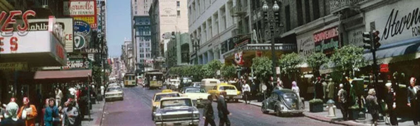

<h4>Timeline</h4>

	<table>
		<thead>
			<tr>
				<th>Anno</th>
				<th>Eventi</th>
			</tr>
		</thead>
		<tbody>
			<tr>
				<td>1859</td>
				<td>A seguito della sempre più rilevante influenza dei Kuei-Jin, il sempre più instabile Delfonso abdica al titolo di Principe in favore del primogeno Tremere: Montelaine</td>
			</tr>
			<tr>
				<td>1877</td>
				<td>Montelaine cade nella rete cospirativa del suo infante Cyrano, che riesce così a divenire il nuovo Principe di San Francisco.</td>
			</tr>			
			<tr>
				<td>1902</td>
				<td>Nash, potente gangrel europeo, sfida e sconfigge Yurok assumendo il titolo di capobranco dei Moon Creek. Conseguentemente, Naira e Railsback abbandonano il branco.</td>
			</tr>
			<tr>
				<td>1905</td>
				<td>Nel dicembre di quest'anno si forma la coterie dei Corvi d'Avorio guidata da Jacques. Ne fanno parte Zeno, Naira, Railsback e Il Diacono.</td>
			</tr>
			<tr>
				<td>1906</td>
				<td>Terremoto di San Francisco. Numerosi Fratelli periscono, compreso lo stesso Principe Cyrano. Zeno e Naira lasciano la città, Jacques torna in Europa, il Diacono scompare dai radar mentre Railsback supporta la scalata al potere di Vannevar, primogeno ventrue.</td>
			</tr>
			<tr>
				<td>1908</td>
				<td>La comunità cainita di San Francisco è nel caos: per via delle lotte di potere la città non ha ancora un Principe. Sebastian Melmoth giunge in città e fonda il Vampire Club, divenendo un fondamentale alleato di Vannevar.</td>
			</tr>
			<tr>
				<td>1913</td>
				<td>Rothstein arriva a San Francisco dove compra il Verdi Club</td>
			</tr>														
			<tr>
				<td>1914</td>
				<td>Scoppia la Prima Guerra Mondiale, Nasce Otto</td>
			</tr>
			<tr>
				<td>1916</td>
				<td>Dopo anni di lotte e complotti, Vannevar diviene ufficialmente il Principe di San Francisco. Alcuni vedono nella sua nomina la mano di Karsh, leggendario warlord della Camarilla, altri i misteriosi Kuei-Jin.</td>
			</tr>
			<tr>
				<td>1917</td>
				<td>Il vampiro Nikolai giunge a San Francisco: convinto zarista, ha abbandonato la Russia a seguito della Rivoluzione. Nel giro dello stesso anno diventerà uno degli uomini più fidati di Vannevar.</td>
			</tr>												
			<tr>
				<td>1920</td>
				<td>Nasce Paul</td>
			</tr>
			<tr>
				<td>1921</td>
				<td>Nasce Robert</td>
			</tr>
			<tr>
				<td>1928</td>
				<td>Nasce Alice</td>
			</tr>			
			<tr>
				<td>1929</td>
				<td>Grande Depressione Economica</td>
			</tr>
			<tr>
				<td>1932</td>
				<td>Nasce Maya</td>
			</tr>
			<tr>
				<td>1939</td>
				<td>Scoppia la Seconda Guerra Mondiale</td>
			</tr>
			<tr>
				<td>1941</td>
				<td>Gli Stati Uniti entrano in guerra, Paul e Robert vengono arruolati nell'esercito</td>
			</tr>
			<tr>
				<td>1944</td>
				<td>Zeno e Naira partecipano alla Rivolta Anarchica di Jeremy MacNeil: nasce il Libero Stato di California. Paul e Robert prendono parte allo Sbarco in Normandia.</td>
			</tr>
			<tr>
				<td>1945</td>
				<td>Paul, tornato dalla guerra, inizia a lavorare come meccanico nell'officina di suo nonno</td>
			</tr>			
			<tr>
				<td>1947</td>
				<td>Robert è testimone dell'Incidente di Roswell e decide di lasciare l'esercito</td>
			</tr>
			<tr>
				<td>1948</td>
				<td>Zeno, deluso dal loro <i>Status Perfectus</i>, lascia gli Anarchici</td>
			</tr>
			<tr>
				<td>1951</td>
				<td>Viene stipulata la Tregua di Fresno tra Camarilla e Anarchici di San Francisco: attorno all'Elixir Pub di Duncan si forma l'enclave anarchico. Zeno ritorna nella Camarilla</td>
			</tr>									
			<tr>
				<td>1952</td>
				<td>Proclamazione della Repubblica Popolare di Polonia. Otto fugge negli USA</td>
			</tr>
			<tr>
				<td>1953</td>
				<td>Dwight Eisenhower è eletto trentaquattresimo Presidente degli Stati Uniti d'America.</td>
			</tr>			
			<tr>
				<td>1954</td>
				<td>Grace Kelly soffia ad Alice il ruolo da protagonista per "Il delitto perfetto", stroncandone di fatto la carriera</td>
			</tr>							
			<tr>
				<td>1955</td>
				<td>Caso Rosa Parks: Edgar Anderson, il padre di Maya, si reca in Alabama per seguirlo in prima persona.</td>
			</tr>																			
		</tbody>
	</table>

<h2>1956</h2>
<dl>
	<dt>3 Gennaio</dt>
	<dd>
		
Paul è alla ricerca del fratello Peter, quando viene abbracciato da Zeno. Per volere di quest'ultimo, uccide suo nonno Paolo Barbieri durante la fase di trasformazione. Accetta di seguire Zeno pur di rintracciare suo fratello

	</dd>
	<dt>30 Gennaio</dt>
	<dd>
		
Viene scagliata una bomba nella casa di Martin Luther King: Edgar, il padre di Maya, si offre di ospitare il famoso attivista nella sua residenza di Montgomery, in Alabama

	</dd>
	<dt>2 Febbraio</dt>
	<dd>
		
Robert indaga nel <i>Marshall Space Flight Center</i> di Huntsville, in Alabama, dove viene provocato e abbracciato dalla misteriosa Naira, che lo lascia al suo destino. Dopo che Zeno lo soccorre, inizia a viaggiare assieme a lui e Paul.

	</dd>
	<dt>19 Aprile</dt>
	<dd>
		
Alice è tra gli invitati del sontuoso matrimonio di Grace Kelly. Durante la crociera attira l'attenzione del fotografo Jacques Chevalier, irritando una delle sue "fan" rischiando di rimetterci un occhio. Jacques l'abbraccia dopo averla fotografata a terra esangue, in un impeto di perverso sadismo estetico.

	</dd>
	<dt>20 Aprile</dt>
	<dd>
		
Otto incontra uno strano collega durante una giornata di lavoro alla Bechtel, e un ancor più strano prete. In seguito tenta un furto alla Villa dei Winchester assieme ai connazionali Dimitri WoŹniak e Ivan Kaczmarek. Tornato a casa, viene abbracciato dal prete sopracitato (Il Diacono) e costretto a cibarsi della piccola Martha. 

   </dd>
</dl>

<a href="/cursed-legacy/diario/1956-5-1.html" class="button">1 Maggio 1956</a>
<a href="/cursed-legacy/diario/1956-5-2.html" class="button">2 Maggio 1956</a>
<a href="/cursed-legacy/diario/1956-5-3.html" class="button">3 Maggio 1956</a>
<a href="/cursed-legacy/diario/1956-5-4.html" class="button">4 Maggio 1956</a>
<a href="/cursed-legacy/diario/1956-5-5.html" class="button">5 Maggio 1956</a>
<a href="/cursed-legacy/diario/1956-5-6.html" class="button">6 Maggio 1956</a>
<a href="/cursed-legacy/diario/1956-5-7.html" class="button">7 Maggio 1956</a>
<a href="/cursed-legacy/diario/1956-5-8.html" class="button">8 Maggio 1956</a>
<a href="/cursed-legacy/diario/1956-6-28.html" class="button">28 Giugno 1956</a>

<dl>
	<dt>Luglio</dt>
	<dd>
		
Peter viene ricoverato in un reparto del St Mary "controllato" dalla Camarilla: in Elysium hanno immediatamente compreso la sua condizione di ghoul e le conseguenze dell'astinenza da sangue vampirico, ma il prolungato periodo trascorso ad Alcatraz sembra averlo debilitato parecchio psicologicamente. [Modalità Cloud sulla Sedia]. Prevedibilmente, ne Paul ne Maya sono ancora riusciti a cavar fuori qualcosa da lui

		
Zeno scompare dalla circolazione: Tequila, Robert e Alice riescono a trovare il Camion la notte seguente, ma del brujah nessuna traccia. I tre riprendono il viaggio verso Los Angeles per conferire con membri delle alte sfere anarchiche sul da farsi

		
Honerius, Paul e altri vampiri si recano ad Alcatraz dove si ricongiungono con lo Sceriffo Railsback: del Diacono, Amelia o Otto sembra non esserci più traccia, nonostante il gruppo prosegua le ricerche per diverse notti.

		
A seguito della scoparsa di Otto, Glory perde l'uso della voce.

	</dd>
	<dt>Agosto</dt>
	<dd>
		
Paul viene nominato Frusta dello Sceriffo e "custode" di Alcatraz, sebbene ufficialmente il Dominio resti nelle mani della dispersa Amelia. La faccenda renderà il Brujah particolarmente antipatico ai Nosferatu della città.

		
Maya e Riley iniziano a collaborare abbastanza spesso: lui racconta quanto è riuscito a scoprire dei movimenti del Sabbat nell'Idaho, mentre Maya svolge qualche indagine per conto del Principe. In Elysium la brujah resta estremamente malvista da Nikolai e Railsback e, sebbene i rapporti con il "fratello" Paul risultino un minimo più cordiali, restano fondamentalmente freddi.

		
Paul rivela a Luke del vampirismo, del suo essere ghoul, e delle condizioni di Peter, scusandosi per averlo fatto a sua insaputa e specificando che la sua condizione è "temporanea". Allo stesso modo, parla anche di Alice e della sua natura cainita mettendolo in guardia facendo leva sul benessere di suo figlio
  

		
Nonostante gli avvertimenti di Paul, Luke cerca inutilmente di trovare Alice sfruttando i suoi contatti.

		
Paul e Maya vengono a scoprire da alcune voci circolanti nell'Elysium del "tradimento" di Robert e Alice, passati tra le fila degli anarchici (la faccenda Zeno, tuttavia, resta ignota)

		
Robert, con il beneplacito degli Anarchici e "garantito" da una lettera di Duncan, parte alla ricerca di Naira e Zeno.

		
Alice viene "adottata" da Isaac Abrams, un Toreador Anarchico molto influente legato all'industria Hollywoodiana

		
Paul tenta in ogni modo di contattare Sarah, ma da Chicago nessuno (nemmeno la famiglia di lei) sembra avere sue notizie. Grazie a Luke il brujah riesce a tranquillizzare i genitori, spiegandogli anche delle condizioni di Peter a seguito del suo ritrovamento e della sua decisione di trasferirsi permamentemente a San Francisco

	
	</dd>
	<dt>Ottobre</dt>
	<dd>
		
Scoppia il secondo conflitto arabo-israeliano. Paul viene a sapere da suo padre che, da quanto trapela dal ghetto ebraico di Chicago, suo figlio è nato il 2 Settembre ed il suo nome è Raphael.

	</dd>		
</dl>

<h2>1957</h2>
<dl>
	<dt>Gennaio</dt>
	<dd>
		
Alexandra Cavendish arriva a San Francisco: è una Ventrue inglese molto influente di base a Washington, nonché stretta amica del Principe Vannevar. Si trova in città per sovrintendere la fondazione della Borsa di San Francisco. In quest'occasione ha modo di conoscere Paul e Maya, e con quest'ultima instaura una vaga amicizia

	</dd>
	<dt>Marzo</dt>
	<dd>
		
Alexandra, sfruttando la fragile Tregua di Fresno stipulata da Vannevar e la propria indiscutibile abilità politico-finanziaria, riesce ad entrare incolume a Los Angeles per proseguire la sua opera nella Borsa locale (in pratica manipola/ghoulizza umani in posizioni strategiche per tenere sotto controllo il mercato). Jeremy MacNeil, leader anarchico del Libero Stato di California, è inizialmente diffidente nei confronti delle "puttanate capitaliste della camarilla", ma dietro una lauta fetta del sempre più fruttuoso mercato DEI BITCOIN accetta di buon grado la temporanea presenza dell'abile Alexandra.

        
Alice, che nel frattempo è divenuta una faccia conosciuta nell'ambiente anarchico della città, memorizza il volto della Ventrue, che a fine mese rientra a Washington

	</dd>
	<dt>Giugno</dt>
	<dd>
		
Sebastian, tramite Duncan, si accorda con l'anarchico Isaac Abrams ed insieme contribuiscono alla fondazione del San Francisco Film Festival. Il Principe permette una breve "estensione" della tregua durante l'evento e Alice, al seguito di Isaac, ha occasione di tornare brevemente nella sua città [possibile giocata flashback]

	</dd>            

	<dt>Ottobre</dt>
	<dd>
		
Robert, bazzicando per la California alla ricerca d'indizi su Naira, viene a sapere del lancio dello Sputnik: la notizia lo sconvolge a tal punto che è vagamente tentato di partire alla volta dell'Unione Sovietica, ma è un desiderio fugace.

	</dd>

	<dt>Novembre</dt>
	<dd>
		
Il Principe Vannevar asseconda la spedizione in Idaho proposta da Riley (contro il parere di Nickolai, Railsback e Honerius) concedendo a Maya e un drappello di altri vampiri di recarsi nell'Idaho alla ricerca di Misty Halls. Paul, sentendosi responsabile per le azioni del fratello Peter, si offre volontario per collaborare.

        <a href="/cursed-legacy/diario/1957-11-1.html" class="button">VEDI FLASHBACK</a>
	</dd>

</dl>

<h2>1958</h2>
<dl>
	<dt>Giugno</dt>
	<dd>
		
Glory, sebbene ancora affetta da novox, si fa carico delle cure di Peter (che non ha manifestato ancora alcun cenno di miglioramento) trasferendolo dal St Mary al proprio Dominio.

		
Paul le è profondamente grato e instaura un buon rapporto con la malkavian

		
Maya a sua volta frequenta spesso la dimora di Glory e, discutendo dei frammenti, quest'ultima le scrive un criptico messaggio:

		
<i>"è tutto un puzzle che compone il segno rancoroso di un vecchio fenicio"</i>

	</dd>

	<dt>Luglio</dt>
	<dd>
		
Viene fondata la NASA: Gli Stati Uniti iniziano a investire ingenti capitali nella corsa spaziale a seguito dei risultati ottenuti dall'URSS l'anno prima. Robert raccoglie ogni informazione che può sulla faccenda

	</dd>

	<dt>Agosto</dt>
	<dd>
		
Paul cerca informazioni su Zeno (ormai scomparso da più di due anni), ma quest'ultimo sembra essere del tutto fuori dall'area di San Francisco.

	</dd>	

</dl>

<h2>1959</h2>
<dl>
	<dt>Giugno</dt>
	<dd>
		
Maya e Paul indagano su "sacrifici" analoghi a quello rinvenuto dalla ragazza nelle fogne nel 1956. In Elysium si sospetta di Delfonso, tuttora scomparso

	</dd>
	<dt>Agosto</dt>
	<dd>
		
Robert è richiamato a Los Angeles e svolge qualche lavoro assieme a Tequila, con cui oramai ha instaurato un buon rapporto di fiducia. Dopo aver dimostrato la sua affidabilità, ottiene il dominio attorno a Lake Hughes, a nord di Los Angeles (ovviamente è un dominio in senso anarchico, quindi non gode dell'autorità e delle garanzie camarilliche)

	</dd>
	<dt>Dicembre</dt>
	<dd>
		
Alice, sfruttando i suoi nuovi contatti tra gli anarchici, scopre molte cose riguardo il passato di Jacques:
		Nonostante il nome "Jacques Chevalier" sia utilizzato solo da una cinquantina d'anni, il suo volto appare in alcune fotografie risalenti al 1842. Gode della protezione del Principe di Rennes, che sembrerebbe essere il suo sire.

	</dd>			

</dl>

<h2>1960</h2>

<dl>
	<dt>Novembre</dt>
	<dd>
		
Elezioni Americane: John Fitzgerald Kennedy batte Richard Nixon. Sebbene lo stato dell'Alabama resti fondamentalmente schierato col Partito Repubblicano, l'importante influenza di Martin Luther King e il contributo del Senatore Anderson (padre di Maya) alimentano la crescita di popolarità di Kennedy tra le minoranze americane

	</dd>

</dl>

<a href="/cursed-legacy/diario/1960-12-31.html" class="button">31 Dicembre 1960</a>

<h2>1961</h2>

<a href="/cursed-legacy/diario/1961-1-1.html" class="button">1 Gennaio 1961</a>
<a href="/cursed-legacy/diario/1961-1-2.html" class="button">2 Gennaio 1961</a>
<a href="/cursed-legacy/diario/1961-1-3.html" class="button">3 Gennaio 1961</a>
<a href="/cursed-legacy/diario/1961-1-4.html" class="button">4 Gennaio 1961</a>
<a href="/cursed-legacy/diario/1961-1-5.html" class="button">5 Gennaio 1961</a>
<a href="/cursed-legacy/diario/1961-1-6.html" class="button">6 Gennaio 1961</a>
<a href="/cursed-legacy/diario/1961-1-7.html" class="button">7 Gennaio 1961</a>
<a href="/cursed-legacy/diario/1961-1-8.html" class="button">8 Gennaio 1961</a>